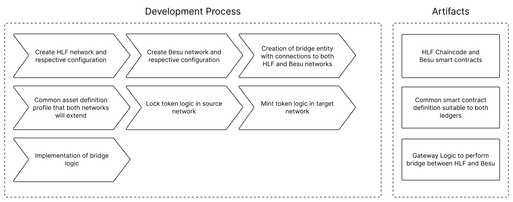
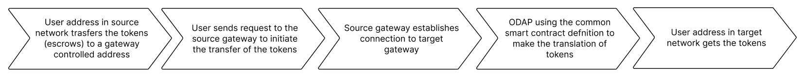
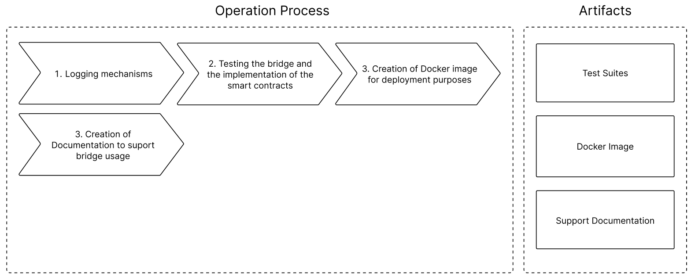

# Development Process

This file provides an overview of the development process to be followed, assuming the implementation is being performed in Hyperledger Cactus, using the implementation of the ODAP plugin.

## Development Process

  

1. **Create HLF network and respective configuration**: creation of the Hyperledger Fabric network using the available Hyperledger Fabric test ledger. For simplicity and demonstration purposes, a simple network with two organizations (Org1 and Org2), with one peer each, and a single orderer entity.

2. **Create Besu network and respective configuration**: creation of the Hyperledger Besu network using the available Hyperledger Besu test ledger. This includes setting up one account to which the tokens will be minted in the EVM side.

3. **Creation of bridge entity with connections to both HLF and Besu networks**: extension to the ODAP plugin where the connections to both networks is made, at the gateway level. At this point no business logic is implemented in either gateway.

4. **Common asset definition profile that both networks will extend**: since the final goal is to make a representation of an on chain's asset in the other one, we need to ensure a common asset definition that both networks need to extend. This can be achieved through the usage of common standards as ERC20, ERC721, etc., or other interface implemented specifically towards our use-case.

5. **Lock token logic in source network**: token locking in the source blockchain can be achieved through the transfer of a token to a gateway controlled smart contract, that will function similarly as an escrow. The respective gateway will have control over the token from that moment on, and cannot be moved until unlocked by the same.

6. **Mint token logic in target network**: minting the token representation in the target blockchain can be achieved by the respective gateway in an address controlled by it. Therefore, one token is created in an address controlled by the gateway, which will then be transferred to the final user. Eventually, the token can be minted directly to the user address if the gateway is authorized to do so.

7. **Implementation of bridge logic**: implementation of the translation of assets from the source to the target network, and mint the token representation in the corresponding target network address.

8. **Extension of the token definition to support/extend the CBDC definition**: explore the necessary extensions to the existing token representation to support a CBDC definition/prototype. This would allow to directly support the CBDC use-case, bridging out CBDCs to an EVM based chain.

9.  **User Interface for the demonstration of the token flow between networks**: this represents the gateway business logic, corresponding to a sequence of actions. A user sends a determined amount of funds to a smart contract deployed in the Hyperledger Fabric network (escrow), and initiates a gateway-to-gateway connection. This will trigger the transfer of the respective token from the source to the target ledger. The transfer will take place according to the common token definition in both networks. Ultimately, the tokens will be minted in the corresponding target address.

  

---

## Operation Process

1. **Logging mechanism**: at the gateway level, and regarding the ODAP implementation we have support for logging, which can be used to audit the system/monitoring, and also for crash fault tolerance. The introduction of logging mechanisms at the bridge, and eventually at the smart contract level would also be valuable for the same purposes (this could also help the development/testing process).

2. **Testing the bridge and smart contracts implementation**: create unit tests at the smart contract level at each side (HLF and Besu), and for the bridging logic. One must have tests comprising only the actual gateway logic, and afterwards having both ledgers connected. Complement with integration tests which would ensure the correct functioning of the bridge. It should be easy to run and test in a demonstration environment.

3. **Creation of Docker image for deployment purposes**: for deployment purposes, we should create a Docker image so as to ease de future deployment procedure of such infrastructure.

4. **Create documentation to suport bridge usage**: we intend to create installation scripts, configs, how to run, how to extend, etc. This is an open door for future collaborations where one can try our solution and eventually extend to support the required use-case.

  

