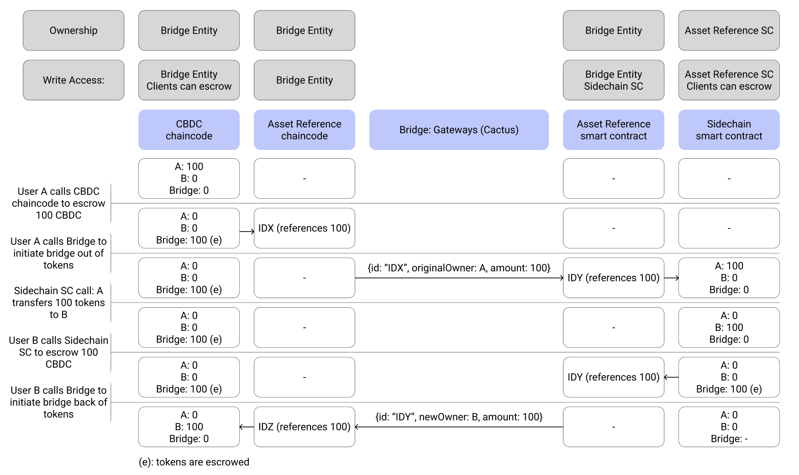

# Implementation

This file provides an overview of the solution to be implemented in Hyperledger Cactus.

## Fabric to Ethereum bridge

The following image depicts a sequence diagram where we can find the interaction between the different components of the system. The flow starts when an end-user (that can be represented by a financial institution, for example) sends some tokens to a controlled address (escrow), which will trigger the creation of an asset reference object. This new data structure has the goal of representing multiple tokens that can be transferred as one single unit.

The transfer is accomplished using ODAP, which firstly locks an asset on the source chain, then deletes, and finally creates a representation of the asset on the target chain. The Asset Reference chaincode and the Asset Reference smart contract represent the common token definition that is implemented by each side of the bridge.

When creating the representation of the asset in the target chain, the amount represented by the asset reference is then minted to the account of the final user in the target chain.

  

## Ethereum to Fabric bridge

When a user wants to bridge back the tokens from the target chain to the source chain, initiates the bridging back of the tokens. This can be either the whole amount that was bridged initially or only a portion (one can take advantage of the split and merge functionality of the asset reference smart contract).

ODAP is initiated and ends with the creation of the representation of the asset reference in the source chain. Internally, this triggers the unlock of the same amount of tokens which is achieved by transferring the tokens to the address of the final user (TBD).

  

### CBDC CC
This smart contract definition intends to specify the CBDC details. This implements ERC-20 standard, which allows the implementation of fungible tokens like a stablecoin. The chaincode uses Fabric Client Identities.

## Bridging Components
### ASSET REFERENCE
This smart contract definition intends to encapsulate a certain amount of a determined token in a new data structure. An asset reference will be locked/created/destroyed/... when running ODAP. The new object has the following properties:
- **id**: ID so that the object can be referenced.
- **isLocked**: boolean indicating whether this object is locked or not.
- **tokens**: the number of tokens referenced in this object
- **typeOfTokens**: the type of tokens referenced in this object

This is one implementation of the common asset definition to be exchanged by the parties involved in the transfer.

This must support at least two functionalities:
- **split**: split one object into two where the sum of the total tokens involved is the same. This opens the door to bridging back to the original chain only a portion of the assets bridged out.
- **merge**: merge two objects into one where the last one represents the sum of the other asset reference tokens. This is particularly useful when one user has to bridge back tokens represented by different asset references. Thus, one can merge them together and initiate only one ODAP session.

### EVM SC
Where the tokens will be minted in the target blockchain. This would have the same token definition as CBDC CC, based on the ERC-20 standard, based on Ethereum addresses.

### GATEWAY 1
Gateway connected to a Hyperledger Fabric network, which has read and write permissions to a determined channel (where the chaincode is deployed).

### GATEWAY 2
Gateway connected to a Hyperledger Besu network, which has read and write permissions in the network (where the smart contracts are deployed).

## Example

The following image depicts the interaction of three different parties (A, B, and the bridging entity) bridging some CBDC.

  

## Ethereum addresses

An address in Ethereum is a 42-character hexadecimal address derived from the last 20 bytes of the public key controlling the account. To access the funds in an ethereum address, one needs to have access to its private key.

Elliptic curve cryptography is a type of public key cryptography based on the discrete logarithm problem as expressed by addition and multiplication on the points of an elliptic curve. Ethereum uses the same elliptic curve as Bitcoin, secp256k1 [1].

## Hyperledger Fabric Identities

In Fabric, the authorization and authentication procedures are based on X.509 certificates issued by Certificate Authorities. The keys of such certificates support Elliptic Curve Cryptography with the following curves: prime256v1, secp384r1, secp521r1 [2].

## References

1. Antonopoulos, A. M., Wood, G., & Wood, G. (2018). Mastering Ethereum: Building Smart Contracts and DApps. Ανακτήθηκε από https://books.google.pt/books?id=SedSMQAACAAJ

2. Hyperledger Community. (n.d.). Fabric CA User's guide¶. hyperledger. Retrieved August 2, 2022, from https://hyperledger-fabric-ca.readthedocs.io/en/release-1.4/users-guide.html
