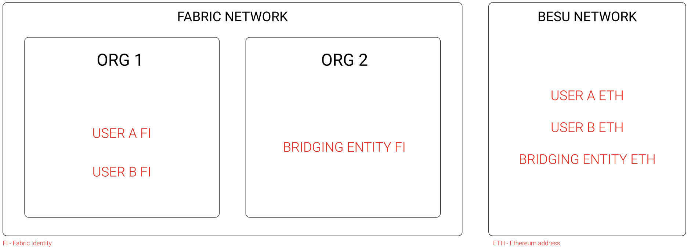

# Test Specification
This file intends to make the testing specification for our bridging application.

## Involved Parties
We assume there is a mapping between the Fabric side and the EVM side, which can be translated into a mapping between client identities and ethereum addresses.

The existing Fabric network comprises two organizations. The first one includes the end/final users of the CBDC (`USER A` and `USER B`), whereas the second represents the organization responsible for the bridging procedure (`BRIDGING ENTITY`).

  

FI - Fabric Identities

ETH - Ethereum address

---

## Fabric Gateway Unit Testing
Goals:
- asset lock by the gateway is successful;
- asset creation by the gateway is successful;
- asset deletion by the gateway is successful;
- escrow of tokens in the CBDC chaincode is working as indented: this corresponds to transferring the tokens to the bridging entity;
- unescrow of tokens in the CBDC chaincode is working as indented: this corresponds to transferring the tokens back to the original owner;
(we can also include the operations to rollback)

Test cases:
- `USER A FI` locks the asset reference in the Asset Reference chaincode successfully. `USER B FI` tries to lock the same asset. Should fail because the asset was already locked.
- `USER A FI` creates an asset reference in the Asset Reference chaincode successfully.
- `USER A FI` deletes an existing asset reference in the Asset Reference chaincode successfully.
- `USER A FI` escrows 100 CBDC and those tokens are transferred to the account of `BRIDGING ENTITY FI`. `USER A FI` tries to transfer the same 100 CDBC to `USER B FI`. Should fail because the CBDC were escrowed.

## EVM Gateway Unit Testing
Goals:
- asset lock by the gateway is successful;
- asset creation by the gateway is successful;
- asset deletion by the gateway is successful;
(we can also include the operations to rollback)
- tokens are minted to the recipient address successfully when creating a new asset reference;
- escrow of tokens in the sidechain smart contract is working as indented: this corresponds to transferring the tokens to the bridging entity;
- when deleting an asset reference, the corresponding tokens are burned from the bridging address;
(we can also include the operations to rollback)

Test cases:
- `USER A ETH` locks the asset reference in the Asset Reference smart contract successfully. `USER B ETH` tries to lock the same asset. Should fail because the asset was already locked.
- `USER A ETH` creates an asset reference in the Asset Reference smart contract successfully.
- `USER A ETH` deletes an existing asset reference in the Asset Reference smart contract successfully.
- `USER A ETH` creates an asset reference in the Asset Reference smart contract. Should trigger the minting of tokens to `USER A ETH` address.
- `USER A ETH` escrows 100 CBDC and those tokens are transferred to the account of `BRIDGING ENTITY ETH`.
- `USER A ETH` deletes an asset reference corresponding to 100 CBDC and those tokens are burned to the account of `BRIDGING ENTITY ETH`.
## Bridging out Testing

Goals:
- Verify if the CBDC is being correctly minted in the EVM side, while being locked (escrowed) in the Fabric side.

Test cases (assuming 100 CBDC have been escrowed in the Fabric side by `USER A ETH`, and therefore, and asset reference representing 100 CBDC was created):
- `USER A FI` initiates the bridging out of 100 CBDC to `USER A ETH`, and 100 CBDC are minted to the address of `USER A ETH`.
- `USER A FI` initiates the bridging out of 100 CBDC to `USER B ETH`, and the operation fails because `USER A FI` cannot mint tokens to another user address.
- `USER B FI` initiates the bridging out of 100 CBDC to `USER B ETH`, and the operation fails because the tokens were escrowed by `USER A FI`.
- `USER A FI` initiates the bridging out of 200 CBDC to `USER A ETH`, and the operation fails because only 100 CBDC were escrowed.
## Bridging back Testing

Goals:
- Verify if the CBDC is being correctly bridged back. This corresponds to burning the CBDC in the EVM side and unlocking them in the Fabric side.

Test cases (assuming 100 CBDC have been escrowed in the EVM side by `USER A ETH`, and therefore, and asset reference representing 100 CBDC was created):
- `USER A ETH` initiates bridging back of 100 CBDC to `USER A FI`. 100 CBDC are burned in `BRIDGING ENTITY ETH`, and only 100 CBDC are unlocked back to `USER A FI` in the Fabric side.
- `USER A ETH` initiates bridging back of 100 CBDC to `USER B FI`. The operation fails, because `USER A ETH` cannot bridge back CBDC to another user.
- `USER A ETH` initiates bridging back of 50 CBDC to `USER A FI`. 50 CBDC are burned in `BRIDGING ENTITY ETH`, and only 50 CBDC are unlocked back to `USER A FI` in the Fabric side.
- `USER A ETH` initiates bridging back of 200 CBDC to `USER A FI`. The operation fails because only 100 CBDC were escrowed.
- `USER B ETH` initiates bridging back of 100 CBDC to `USER B FI`. The operation fails because the tokens were escrowed by `USER A ETH`.
