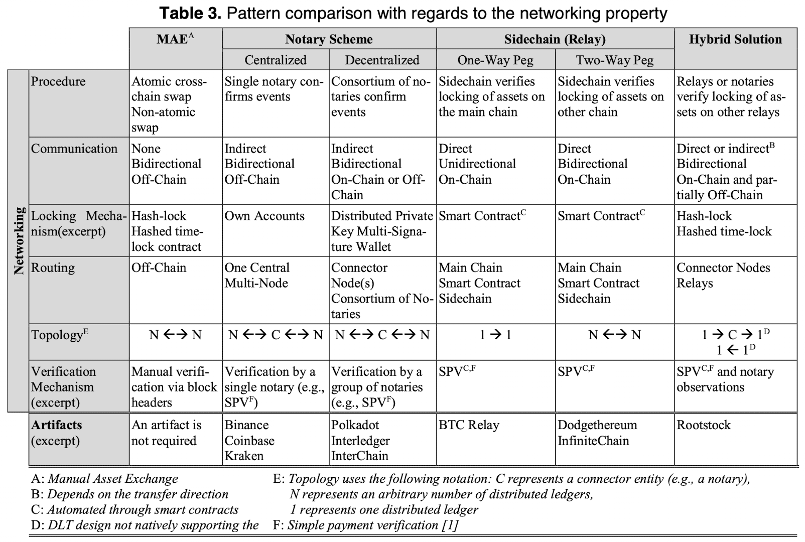
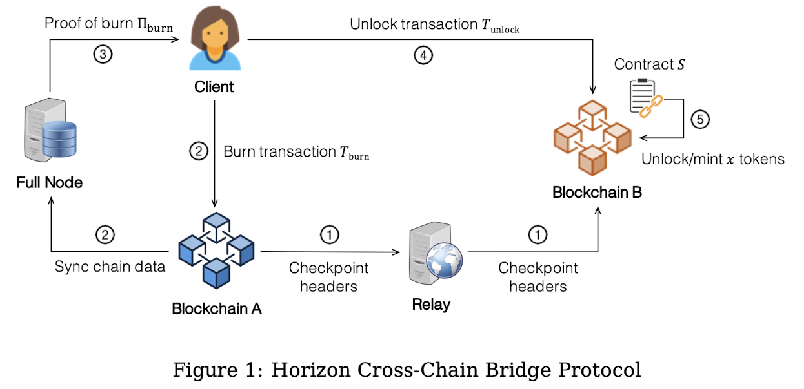
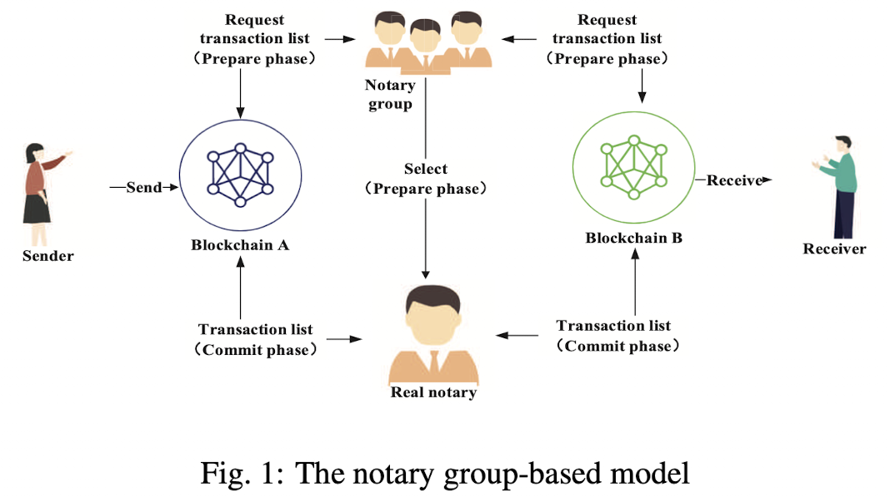
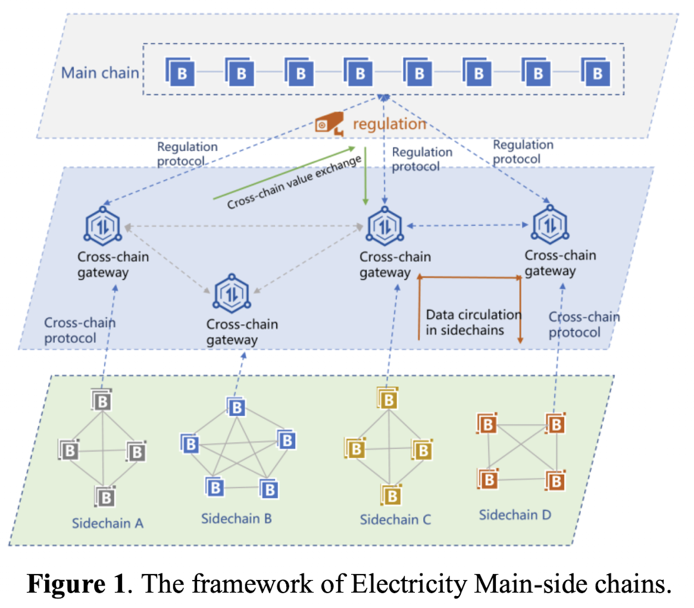

# Main Ideas on Token Bridging Solutions

# Table of Contents
- [Main Ideas on Token Bridging Solutions](#main-ideas-on-token-bridging-solutions)
- [Table of Contents](#table-of-contents)
  - [Papers](#papers)
    - [Bridges between islands: Cross-chain technology for distributed ledger technology](#bridges-between-islands-cross-chain-technology-for-distributed-ledger-technology)
    - [Bridging Sapling: Private Cross-chain Transfers](#bridging-sapling-private-cross-chain-transfers)
    - [Horizon](#horizon)
    - [A notary group-based cross-chain mechanism](#a-notary-group-based-cross-chain-mechanism)
    - [An Electricity Cross-Chain Platform based on Sidechain Relay](#an-electricity-cross-chain-platform-based-on-sidechain-relay)

## Papers

### Bridges between islands: Cross-chain technology for distributed ledger technology

Analysis of the cross-chain solutions state of the art.
The authors divide the solutions into four categories: Manual Asset Exchanges, Notary Schemes, Sidechains (Relays), and Hybrid (includes all previous).
The authors also mention the different use cases for Cross-Chain Technology: asset transfers, asset exchanges, cross-chain oracles, and cross-chain smart contracts.

All these ideas are compared against some properties like Administration, Flexibility, Performance, and Security.

The overall paper is a little outdated but demonstrates simple concepts and designs for the development of a cross-chain solution. The solutions are not directed to the general use in permissioned environments (i.e., some work but under assumptions).

### Bridging Sapling: Private Cross-chain Transfers

Propose ZCLAIM protocol, an adaptation of XCLAIM for Zcash.
Zcash was the first project to implement zk-SNARKs, a novel form of zero-knowledge cryptography that gives its users the strongest privacy available in any digital currency.

There are different actors in the protocol, the issuers (lock ZEC and request same amount of wZEC), the redeemers (destroy wZEC and request corresponding amount of ZEC), and the vaults (non-trusted intermediaries that act as custodians, safekeeping locked ZEC).

The authors specify the operations/functions performed by every actor (lock, mint, burn).

This assimilates to our needs since Zcash is focused on privacy, however the actual blockchain is not permissioned, thus both parties have access to both ledgers. In fact, the issuer needs to make transactions in the issuing ledger, which is not possible in a permissioned setting.

### Horizon

A protocol that performs cross-chain transfer of assets from a BFT blockchain to another blockchain (e.g., Ethereum) that supports basic smart contract execution.

The authors motivate the work based on the cost of making the verification of proofs costly in BFT based networks. Today, existing relay solutions include SPV clients that are used to verify proofs. In the case of a BFT network, a there is the need of verifying the quorum of signatures which is very costly since this quorum might be changing from time to time (e.g., different epochs can mean different members signing).

The authors base the threat model of the protocol on rational adversaries, in which an entity misbehaves only if it benefits from it. Apart from this, the protocol is byzantine behavior resistance. Atomicity is guaranteed, but only assuming there is a Trusted Third party that acts in the client's interest by financial insuring the assets.

The Client issues a burn transaction in its local blockchain, which will then create a proof (Proof of Burn). The relay node sends to the counter party blockchain the block headers since last epoch (i.e., periodically), which can verify the PoB as soon as it receives an unlock/mint transaction from the client. This works through an SPV in the BFT chain.

### A notary group-based cross-chain mechanism

This paper proposes a solution based on a Notary Group, which is composed of multiple nodes that are forced to have an account in each blockchain (created in the prepare phase of the protocol). The main goal is to decentralize common notary schemes solutions that have single point of failure.

Each notary has a reputation value important when electing one notary to serve a cross-chain transaction, and an incentive mechanism is used to ensure the security of the system and encourage nodes to maintain the network. There are misbehave consequences, which consequently reduces the reputation of a notary and the nodes that identified the faulty one(s) are rewarded.

This is similar to solutions that have a decentralized network to verify the correctness of cross-blockchain transactions, in this case it is a group of entities called notary-group that have an incentive mechanism. This could definitely be represented by another blockchain, that would use a consensus mechanism to ensure the transactions are valid. This would decentralize more the protocol.

In the middle of the prepare and commit phase, it is stated that one notary needs to be chosen to conduct the cross-chain transfer. Therefore, a message is set to every notary and each one will decide whether to participate in the notary election based on the content of the transaction. The problem arises when one of these notaries crash, will the protocol stall until it receives a message from all? The authors measure the influence of having malicious nodes but do not mention crash faults.

### An Electricity Cross-Chain Platform based on Sidechain Relay

The authors propose a new system to realize cross-chain transactions between heterogeneous networks. The system is compared with Cosmos and Polkadot, that have a similar idea, having a main chain to which other chains are connected.

The authors propose a layered architecture composed of the main chain, cross-chain gateways/piers, and the sidechains. 

This paper mentions IBTP, which I suppose is a communication protocol (like IBC in Cosmos, or XCMP in Polkadot), but no information is given on this topic.

It is mentioned that regulatory protocols are verified, and also identity management, but not much detail is provided, the paper lacks some technical specifications.

The main chain completely acts as the bottleneck in the network. The maximum throughput is achieved when 18 blockchains are connected, which are far away from the numbers provided (and expected in the future) for both Polkadot and Cosmos.

