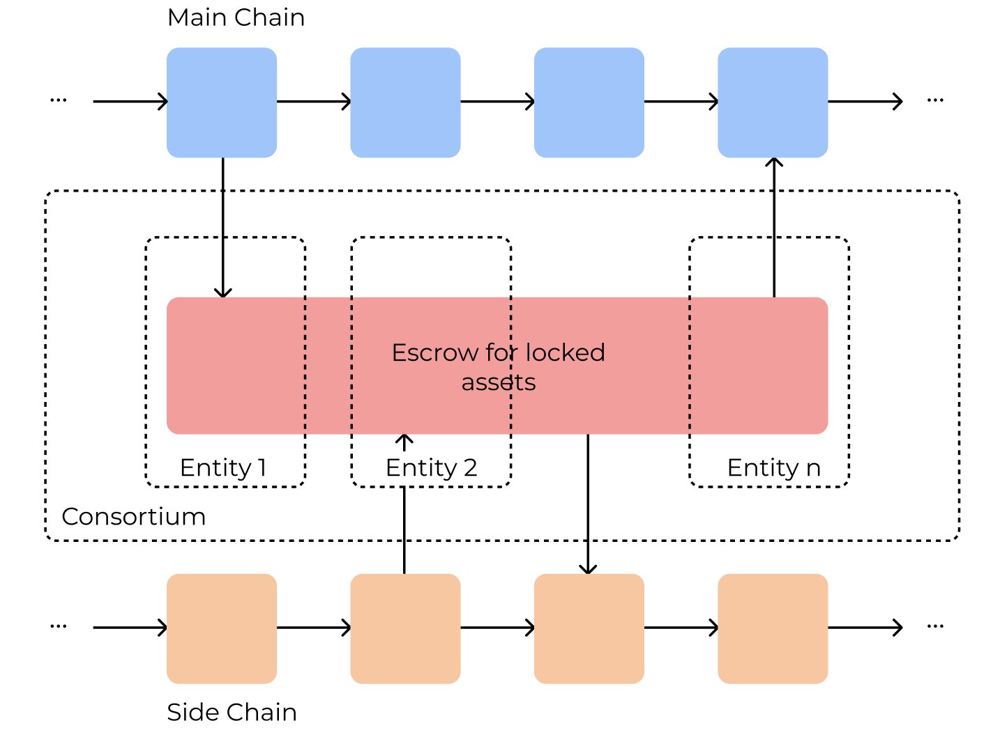
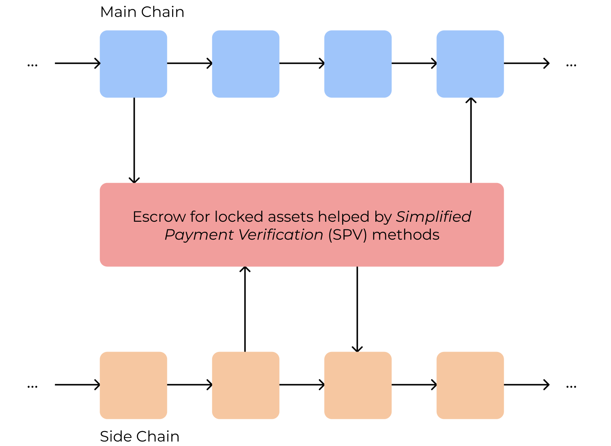

# Report on Token Bridging Solutions

# Table of Contents
- [Report on Token Bridging Solutions](#report-on-token-bridging-solutions)
- [Table of Contents](#table-of-contents)
  - [Motivation](#motivation)
  - [Research Questions](#research-questions)
  - [Means to achieve interoperability](#means-to-achieve-interoperability)
    - [Sidechains](#sidechains)
    - [Notary Schemes](#notary-schemes)
    - [Blockchain of Blockchains](#blockchain-of-blockchains)
    - [Trusted Relays](#trusted-relays)

## Motivation
As blockchain technology continues to thrive across many industries, new applications and solutions are being developed everyday. At the moment there is an immense variety of public and private blockchains that have their ideas and technology stack according to the use cases and goals they were designed to accomplish. One of the consequences of the increase of the number of blockchains is the fragmentation of the industry, where blockchain networks are considered data silos, isolated from each other. In order to reach a higher level of integration of blockchain solutions, we need to design and implement new protocols to interconnect the existing systems through bridging solutions (a bridge between blockchain A and B). We can, thus, think about bridging as one solution to achieve blockchain interoperability.

## Research Questions
* What are the current approaches to perform cross-chain bridges?
* What are the services/functionalities offered by token bridging solutions?
* What are the requirements for a successful bridging solution?
* What are the current bridging solutions in permissioned environments (or partially)?
* Are there dependencies (from the bridging solution) on the underlying technologies?
* Are there any bridging solutions between Hyperledger Fabric and Ethereum?

## Means to achieve interoperability

From our analysis of the state of the art, we can divide the existing bridging solutions into three categories:

1. Sidechains
2. Notary Schemes
3. Blockchain of Blockchains
4. Trusted Relays

### Sidechains
The first interoperability approach we discuss here are sidechains. A sidechain, is a chain that extends another one, being considered as a secondary chain of the main one. As an example, we could consider a sidechain for Bitcoin that supports the deployment of smart contracts, which would be an extension to the Bitoin network but including scripting capabilities. The most common interaction between the main chain and sidechains is a two-way peg, where the communication is done in either directions. There are **three types of two-way pegs**: **centralized**, **federated** or **through SPVs** (Simplified Payment Verification):

- In the first one, there is one central entity that makes the interconnection of both chains, and regulates the actions that are made in between, consequently, the protocol only moves forward when the previous one was verified.

- Next, federated two-way pegs tries to decentralize the previous solution, where there is a group of entities that perform the validations yielding multi-signatures, in which a quorum of participants must sign each transaction.

- Finally, in the last one, there is the implementation of a light client on the sidechain which makes possible the validation of transactions and state in the main chain. This is achieved by storing only the block headers and not the entire main chain. This approach can be extrapolated to other solutions.

BTCrelay, a smart contract deployed in the Ethereum network is an example of such mechanism. It provides provides interoperability between Bitcoin and Ethereum, that uses the Bitcoin blockchains' block headers to make verifications (e.g., the transaction corresponding to the lock of an asset). This last solution improves the decentralization of the prior solutions since it does not require a trusted third party to mediate the transfers.

  
  
  
  Images based on "Sidechain technologies in blockchain networks: An examination and state-of-the-art review"

### Notary Schemes
Notary schemes based systems rely on an external entity (third-party entity) to interconnect blockchains. Some common examples of these systems are cryptocurrency exchanges. In this architecture, it is the responsibility of the notary to make the necessary verifications (e.g., the asset is locked in the source blockchain) and ensure the atomicity of the asset transfers. This is achieved through the deployment of nodes in the involved blockchains (or have that done beforehand), which then communicate with each other.

There are some problems with this approach. The first one relies on centralization. By relying on a central notary, we are relying on its truthfulness to control and manage the assets. Additionally, since we are talking about a central entity it can suffer from Denial of Services attacks, which by having this single point of failure can risk availability. *"A notary group-based cross-chain mechanism"* proposes a new protocol that replaces this single entity with a group of notaries that perform the transfers. This is a step forward in the decentralization direction, however, we still need to trust our funds to this new entity.

Similarly to this approach we mention "Atomic Commitment Across Blockchains" which employs a witness network to perform atomic cross-chain transactions between two or more blockchains. The protocol is based on the deployment of smart contracts in each involved network (similarly to HTLCs), which is then verified by the miners of the witness blockchain.

### Blockchain of Blockchains
Blockchain of Blockchains are considered frameworks to build application-specific blockchains providing reusable data, network, consensus, incentive, and contract layers. Sometimes these solutions are also called relays because they make use of a relay chain, through which communication is made between different blockchains.

Polkadot is a “scalable heterogeneous multi-chain”, appearing as one of the leading platforms that intends to connect public (permissionless) and private (permissioned) blockchains. The blockchains that anyone can create and connect to the Relay chain are called parachains. There is a special type of parachains, called bridge parachains, which enable the transfer of information between different parachains through the Cross-Chain Message Passing Protocol (XCMP), where messages have a standardized format, the Cross-Consensus Messaging Format (XCM).

Just like Polkadot, Cosmos also proposed a novel network architecture that connects heterogeneous blockchains called zones, to the Cosmos Hub (there can be multiple hubs). The Cosmos Hub in Cosmos acts like the Relay Chain in Polkadot, thus any blockchain can be plugged into the network in the form of a zone (parachains in Polkadot). The communication between zones and the Hub is done using the Inter-Blockchain Communication protocol (IBC), allowing interoperability between chains.

From a high-level perspective, both these solutions address interoperability roughly the same way, by having a main chain that is connected to several other chains, that can also interoperate with each other. However, the way both systems are used in the industry as either one or the other, actually does not remove the existing fragmentation. Instead of having blockchain fragmentation, we have blockchains of blockchains fragmentation, which in fact leads to the same problem. Efforts to interconnect these networks could be done in order to improve the interoperability solutions.

A key difference between both these networks is how network security is handled. In Polkadot, the Relay Chain provides shared security, where it is the connector between parachains and bridges. Through this mechanism, it relies on entities that look for malicious behavior from validators that, if necessary, rollback any invalid transaction that was submitted to the relay chain by malicious nodes. On the other hand, in Cosmos, each blockchain is independent of the other, managing its own security criteria, providing more flexibility, and making the Cosmos Hub not so coupled to the chains. In order to make a cross-chain transaction, one zone needs to trust the Hub to make the routing and the other zone for validation purposes, whereas in Polkadot, given the shared security, there can be some more trust to make these transfers.

### Trusted Relays
TBD
