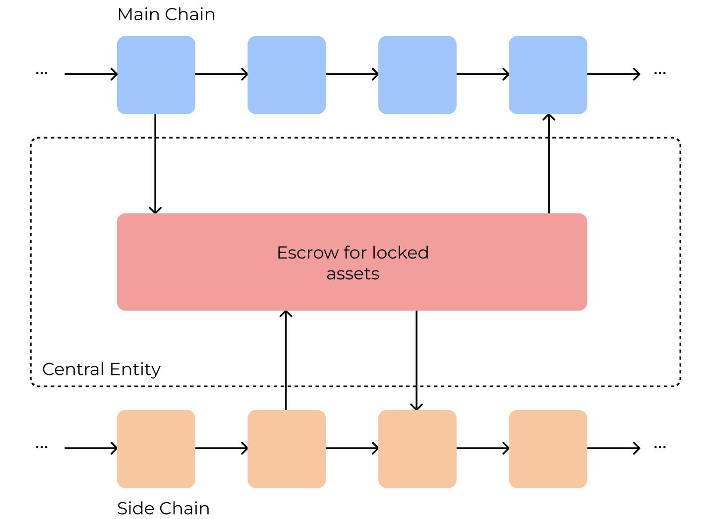
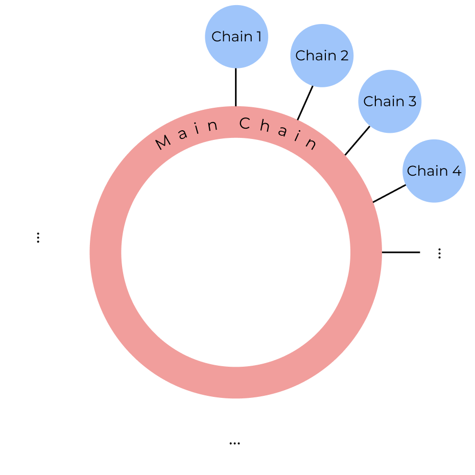

# Report on Token Bridging Solutions

- [Report on Token Bridging Solutions](#report-on-token-bridging-solutions)
  - [Motivation](#motivation)
  - [Research Questions](#research-questions)
  - [Means to achieve interoperability](#means-to-achieve-interoperability)
    - [Sidechains](#sidechains)
    - [Notary Schemes](#notary-schemes)
    - [Blockchain of Blockchains](#blockchain-of-blockchains)
    - [Trusted Relays](#trusted-relays)
  - [Main differences between bridge solutions](#main-differences-between-bridge-solutions)
    - [**Centralization**](#centralization)
    - [**Security**](#security)
    - [**Privacy**](#privacy)
    - [**Scalability**](#scalability)
    - [**Applicability**](#applicability)
  - [Main functionalities offered by bridges](#main-functionalities-offered-by-bridges)
  - [Hyperledger Fabric - Ethereum bridge using IBC (from Datachain)](#hyperledger-fabric---ethereum-bridge-using-ibc-from-datachain)
  - [References](#references)
  

## Motivation
As blockchain technology continues to thrive across many industries, new applications and solutions are being developed everyday. At the moment there is an immense variety of public and private blockchains that have their ideas and technology stack according to the use cases and goals they were designed to accomplish. One of the consequences of the increase of the number of blockchains is the fragmentation of the industry, where blockchain networks are considered data silos, isolated from each other. In order to reach a higher level of integration of blockchain solutions, we need to design and implement new protocols to interconnect the existing systems through bridging solutions (a bridge between blockchain A and B). We can, thus, think about bridging as one solution to achieve blockchain interoperability.
  

## Research Questions
* What are the current approaches to perform cross-chain bridges?
* What are the services/functionalities offered by token bridging solutions?
* What are the requirements for a successful bridging solution?
* What are the current bridging solutions in permissioned environments (or partially)?
* Are there dependencies (from the bridging solution) on the underlying technologies?
* Are there any bridging solutions between Hyperledger Fabric and Ethereum?
  

## Means to achieve interoperability

From our analysis of the state of the art, we can divide the existing bridging solutions into three categories:

1. Sidechains
2. Notary Schemes
3. Blockchain of Blockchains
4. Trusted Relays
  

### Sidechains
The first interoperability approach we discuss here are sidechains. A sidechain, is a chain that extends another one, being considered as a secondary chain of the main one. As an example, we could consider a sidechain for Bitcoin that supports the deployment of smart contracts, which would be an extension to the Bitcoin network but including scripting capabilities. The most common interaction between the main chain and a sidechain is a two-way peg, where the communication is done in either directions. There are **three types of two-way pegs**: **centralized**, **federated** or **through SPVs** (Simplified Payment Verification):

- In the first one, there is one central entity that makes the interconnection of both chains, and regulates the actions that are made in between, consequently, the protocol only moves forward when the previous one was verified.

- Next, federated two-way pegs tries to decentralize the previous solution, where there is a group of entities that perform the validations yielding multi-signatures, in which a quorum of participants must sign each transaction.

- Finally, in the last one, there is the implementation of a light client on the sidechain which makes possible the validation of transactions and state in the main chain. This is achieved by storing only the block headers and not the entire main chain. This approach can be extrapolated to other solutions.

BTC Relay, a smart contract deployed in the Ethereum network is an example of such mechanism. It provides provides interoperability between Bitcoin and Ethereum, that uses the Bitcoin blockchains' block headers to make verifications (e.g., the transaction corresponding to the lock of an asset). This last solution improves the decentralization of the prior solutions since it does not require a trusted third party to mediate the transfers.

Examples of deployed systems: BTC Relay, and Bitcoin's Liquid Network.

  
  
  
  Two-way peg modes (centralized, federated, spv). Images based on [4].

  

---

### Notary Schemes
Notary schemes based systems rely on an external entity (third-party entity) to interconnect blockchains. Some common examples of these systems are cryptocurrency exchanges. In this architecture, it is the responsibility of the notary to make the necessary verifications (e.g., the asset is locked in the source blockchain) and ensure the atomicity of the asset transfers. This is achieved through the deployment of nodes in the involved blockchains (or have that done beforehand), which then communicate with each other.

There are some problems with this approach. The first one relies on centralization. By relying on a central notary, we are relying on its truthfulness to control and manage the assets. Additionally, since we are talking about a central entity it can suffer from Denial of Services attacks, which by having this single point of failure can risk availability. [2] proposes a new protocol that replaces this single entity with a group of notaries that perform the transfers. This is a step forward in the decentralization direction, however, we still need to trust our funds to this new entity.

Reference [1] presents a similar approach, employing a witness network to perform atomic cross-chain transactions between two or more blockchains. The protocol is based on the deployment of smart contracts in each involved network (similarly to HTLCs), which is then verified by the miners of the witness blockchain.

Examples of deployed systems: Binance, and Coinbase.

  

  

---

### Blockchain of Blockchains
Blockchain of Blockchains are considered frameworks to build application-specific blockchains providing reusable data, network, consensus, incentive, and contract layers. Sometimes these solutions are also called relays because they make use of a relay chain, through which communication is made between different blockchains.

Polkadot is a “scalable heterogeneous multi-chain”, appearing as one of the leading platforms that intends to connect public (permissionless) and private (permissioned) blockchains. The blockchains that anyone can create and connect to the Relay chain are called parachains. There is a special type of parachains, called bridge parachains, which enable the transfer of information between different parachains through the Cross-Chain Message Passing Protocol (XCMP), where messages have a standardized format, the Cross-Consensus Messaging Format (XCM).

Just like Polkadot, Cosmos also proposed a novel network architecture that connects heterogeneous blockchains called zones, to the Cosmos Hub (there can be multiple hubs). The Cosmos Hub in Cosmos acts like the Relay Chain in Polkadot, thus any blockchain can be plugged into the network in the form of a zone (parachains in Polkadot). The communication between zones and the Hub is done using the Inter-Blockchain Communication protocol (IBC), allowing interoperability between chains.

From a high-level perspective, both these solutions address interoperability roughly the same way, by having a main chain that is connected to several other chains, that can also interoperate with each other. However, the way both systems are used in the industry as either one or the other, actually does not remove the existing fragmentation. Instead of having blockchain fragmentation, we have blockchains of blockchains fragmentation, which in fact leads to the same problem. Efforts to interconnect these networks could be done in order to improve the interoperability solutions.

A key difference between both these networks is how network security is handled. In Polkadot, the Relay Chain provides shared security, where it is the connector between parachains and bridges. Through this mechanism, it relies on entities that look for malicious behavior from validators that, if necessary, rollback any invalid transaction that was submitted to the relay chain by malicious nodes. On the other hand, in Cosmos, each blockchain is independent of the other, managing its own security criteria, providing more flexibility, and making the Cosmos Hub not so coupled to the chains. In order to make a cross-chain transaction, one zone needs to trust the Hub to make the routing and the other zone for validation purposes, whereas in Polkadot, given the shared security, there can be some more trust to make these transfers.

Examples of deployed systems: Polkadot, and Cosmos.

  

  

### Trusted Relays
Trusted Relays are trusted parties that, through the implementation of core components (that implement the necessary business logic) and blockchains adapters/connectors, provide interoperability between the same blockchains. This approach opens the door to interoperable solutions between any kind of blockchain, in which the only requirement is the implementation of specific APIs, thus being a scalable and extensible architectural pattern. To support one blockchain, a connector/adapter needs to be implemented in the relay which seamlessly integrated with the respective blockchain.
There is one drawback when choosing this solution to realize interoperability. This relay is trusted including, the core component that defines the business logic. We, thus, need to rely on trusted hardware (Trusted Platform Module — e.g., Intel SGX), or decentralize this relay with the deployment of multiple nodes. Hyperledger Cactus [5] can be considered a trusted relay that achieves interoperability by leveraging a consortium of Cactus nodes.

Examples of deployed protocols: Interledger [6] and ODAP [7].

  

  

---

## Main differences between bridge solutions
From our research, we can classify the different bridging solutions regarding different categories: centralization, privacy, scalability, and applicability.

### **Centralization**
The first concern when designing a bridging solution is whether the bridge is centralized or decentralized. Naturally, this concept is tightly coupled with privacy and trust levels as explained in the next section. One can design a centralized solution like a traditional single entity notary scheme which is responsible for the interoperable solution. Unfortunately, this suffers from single point failures and eventual DoS attacks. Therefore, solutions that have this scheme are susceptible to 

### **Security**
With regards to the assets being exchanged or transferred we need to evaluate the risk of losses. Either the assets are escrowed by a third party (normally in mediated designs) or by automated smart contracts. In the first one, there is the risk of having the assets stolen from this third party entity, whereas in the latter, the risk is focused on the one-shot implementation of a smart contract (e.g., a bug in the code could cause the loss of assets).

### **Privacy**
When talking about any kind of system, and specially one with interaction with users, it is important to mention privacy. We firstly define privacy in the context of blockchain bridging. The notion of privacy is tightly coupled with the disclosure of private information of the parties involved in a cross-chain transfer. We can divide the requirements as:
- No information related to the involved entities should be disclosed, such as personal/sensitive information.
- It should not be possible to link transactions in different blockchains concerning the same cross-chain transfer. This property is called *Fungibility* by [8].

Additionally there are issues related to the privacy of the users. In common centralized exchanges, such as Binance, users need to disclose private information such as name, age, address, etc, to this third party entity.

In a smart contract environment, one would only disclose a digital address, which would be liked to a certain transaction or smart contract call. It is possible to develop protocols that capture the transactions made involving some address and link it to the actual person/entity behind it. This introduces the concept of pseudonymization, where the true data is hidden from the world, but it is reversible because the original data can be obtained.

Some solutions also leverage zk-SNARKs based on zero-knowledge proofs to overcome privacy issues.

### **Scalability**
When talking about scalability of networks (or extensibility of the protocols to other entities).

When designing an interoperability solution, it is of major importance to think about scalability or extensibility of the protocols. Firstly, we can consider scalability as a means to perform transfers of assets between the highest number of blockchains as possible. And lastly, it is possible to think about atomic multi-party transfers (e.g., 1-N transfers between N entities).

As a means of comparison we can think about blockchains of blockchains as networks that are scalable until a certain point due to the limited number of slots for chains (Polkadot has only 100 slots for parachains). On the other hand, trusted relays act as systems that are easily scalable and extendible to other, at the distance of developing one blockchain adapter/connector.

### **Applicability**
It is also important to understand what are the protocols' use-cases: transfer of assets, tokens, or general data. The first efforts done towards blockchain interoperability were focused on the exchange of tokens. Through the time the focus has been changing to other types of assets (e.g., NFTs), and general data.
  

---
The following table summarizes the key differences between the aforementioned solutions.

| Metric/Solution            | Sidechains                                 | Notary Schemes                                               | Blockchain of Blockchains                                     | Trusted Relays                              |
| -------------------------- | ------------------------------------------ | ------------------------------------------------------------ | ------------------------------------------------------------- | ------------------------------------------- |
| Validation                 | SPVs                                       | Through deployed nodes and possibly SPVs                  | Through ledger adapters/connectors                            | Relay through ledger adapters/connectors |
| Centralized                | NO                                         | YES                                                          | NO                                                            | NO                                          |
| Trust funds to third party | NO                                         | YES                                                          | NO                                                            | NO                                          |
| Scalable/Extensible        | NO                                         | YES                                                          | YES (under network restrictions)                              | YES                                         |
| Underlying Technology      | Smart Contracts SPVs                    | Smart Contracts and possibly SPVs if notary deployed light nodes | Dependent on the network (XCMP in Polkadot; IBC in Cosmos) | Smart Contracts                             |
| Implementation             | Sidechain smart contract                   | Deployment of blockchain node                             | Chain compliant with network restrictions and APIs         | Development of adaptor/connector         |
| Architecture               | Main Chain Side Chain Smart Contract | Notary Entity(ies)                                           | Main Chain Side Chains                                     | Business Logic Component Ledger Adaptor  |

---

## Main functionalities offered by bridges
We summarize the main functionalities/services offered by bridges as:
- Lock assets/tokens
- Burn assets/tokens
- Mint/Re-create assets
- Asset state verification
- Specific business logic operations
- Exchange rate oracles (or asset transformation schemes)
  

## Hyperledger Fabric - Ethereum bridge using IBC (from Datachain)
There is currently a solution between Hyperledger Fabric and Ethereum that leverages IBC.
As aforementioned IBC stands for Inter-Blockchain Communication and is a protocol that can be used for the communication between any chain that implements the protocol.
There is almost no information about the details of this solution but we intend to summarize our findings through the information present in Medium articles and GitHub repositories documentation.

<ol>
  <li>
  Motivation:
  Due to service requirements and regulation issues, there will be two separate blockchains, one managing assets (securities, real estate, etc.) and the other managing payment tokens. In such a case, it is necessary to realize a DvP settlement between the two blockchains, the asset blockchain and the payment blockchain.
  Specifically, if the ownership of the asset token managed by the asset blockchain is transferred from Alice to Bob, and the payment token managed by the payment blockchain is transferred from Bob to Alice, the balance updates in the asset blockchain and the payment blockchain need to be performed atomically.
  </li>
   
  <li>
  To develop a bridge between Hyperledger Fabric and Ethereum it is required that both these systems implement IBC. The authors built extensions of the networks to support the protocol. Here are the GitHub repositories:

  - https://github.com/hyperledger-labs/yui-fabric-ibc
  - https://github.com/hyperledger-labs/yui-ibc-solidity

  Both of these systems can communicate with any other chain that supports IBC.
  </li>
   
  <li>
  This is done through an entity which is the relayer. It is an off-chain process defined by IBC that has the ability to read the state of transactions on a blockchain and relay them as Packets between blockchains. This relayer opens <a href="https://github.com/datachainlab/public-docs/blob/master/fabric-ibc/en/06_appendix.md">some issues</a> related to Fabric private environment.
  
  - https://github.com/hyperledger-labs/yui-relayer
  </li>
   
  <li>
  Atomicity: 
  They use the Cross Framework that enables distributed transactions over multiple blockchains. It enables the execution of a smart contract from one blockchain on the other:
  
  - https://github.com/datachainlab/cross
  - https://medium.com/@datachain/cross-framework-introduction-f25d7bbfcd9a
  </li>
</ol>

The restriction that arises from this approach is that it is required an extension of blockchains to support IBC.
Additionally, given the private nature of Fabric there can arise some problems as mentioned in:
- https://github.com/datachainlab/public-docs/blob/master/fabric-ibc/en/06_appendix.md#regarding-the-privacy-of-relayer

**Other Useful Links**

- https://medium.com/@datachain/datachain-and-ntt-data-successfully-verified-a-bridge-between-ethereum-and-hyperledger-fabric-using-56a96480e8a4
- https://johnniecosmos.medium.com/inter-blockchain-communication-protocol-ibc-the-tcp-ip-protocol-of-blockchains-bridges-trends-b38ed700c681

---
## References

1. Zakhary, V., Agrawal, D., & Abbadi, A. E. (2019). Atomic commitment across blockchains. arXiv preprint arXiv:1905.02847.

2. Xiong, A., Liu, G., Zhu, Q., Jing, A., & Loke, S. W. (2022). A notary group-based cross-chain mechanism. Digital Communications and Networks.

3. Belchior, R., Vasconcelos, A., Guerreiro, S., & Correia, M. (2021). A survey on blockchain interoperability: Past, present, and future trends. ACM Computing Surveys (CSUR), 54(8), 1-41.
   
4. Singh, A., Click, K., Parizi, R. M., Zhang, Q., Dehghantanha, A., & Choo, K. K. R. (2020). Sidechain technologies in blockchain networks: An examination and state-of-the-art review. Journal of Network and Computer Applications, 149, 102471.

5. Montgomery, H., Borne-Pons, H., Hamilton, J., Bowman, M., Somogyvari, P., Fujimoto, S., … Belchior, R. (2022). Hyperledger Cactus Whitepaper. Hyperledger website: https://github.com/hyperledger/cactus/blob/main/whitepaper/whitepaper.md

6. Wu, L., Kortesniemi, Y., Lagutin, D., & Pahlevan, M. (2021, September). The flexible interledger bridge design. In 2021 3rd Conference on Blockchain Research & Applications for Innovative Networks and Services (BRAINS) (pp. 69-72). IEEE.

7. M. Hargreaves, T. Hardjono, R. Belchior, Open digital asset protocol draft
02, draft-hargreaves-odap-03, 2021, Internet Engineering Task Force, URL
https://datatracker.ietf.org/doc/html/draft-hargreaves-odap-03.

8. Thyagarajan, S. A., Malavolta, G., & Moreno-Sánchez, P. (2021). Universal atomic swaps: Secure exchange of coins across all blockchains. Cryptology ePrint Archive.