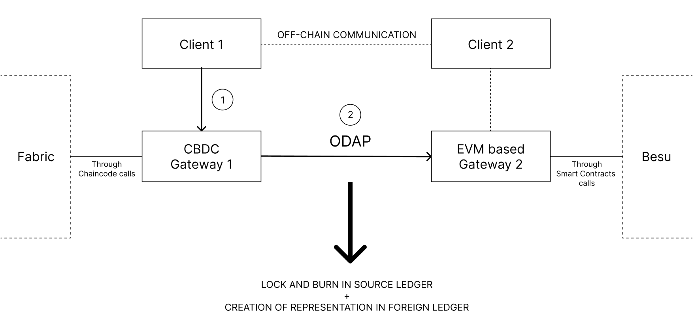
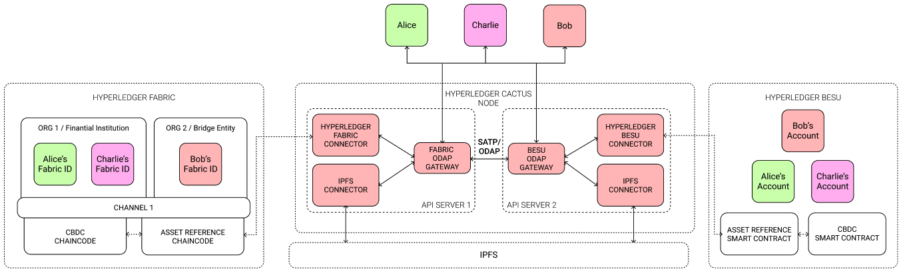

# Design Specification

This file provides an overview for the solution design to be implemented in Hyperledger Cactus.

## Global Architecture

The solution will be implemented by leveraging ODAP (Open Digital Asset Protocol).

  

## Cactus Implementation Architecture

  

